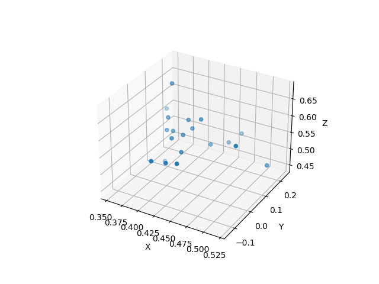

# Nerf dataset recorder

Утилита для записи датасета с камеры, закрепленной на марипуляторе UR5

## Установка
```bash
mkdir catkin_ws && cd catkin_ws
mkdir src && cd src
git clone 
cd ../
catkin_make
source devel/setup.bash
```

## Запуск

Для облета по окружности 

```roslaunch nerf-ds-recorder circle.launch```

Для запуска по точкам.

```roslaunch nerf-ds-recorder waypoints.launch```


```bash
usage: nerf-ds-recorder [-h] -i IMG_CAMERA -l DEPTH_CAMERA [-n NUMBER] [-d DIR] [-t {circle,rectangle,waypoints}] [--hfov HFOV] --ip IP [-r RADIUS]
                        [-p POSITION POSITION POSITION] [--normal NORMAL NORMAL NORMAL]
                        __name __log

records dataset from robot for nerf learning

positional arguments:
  __name
  __log

optional arguments:
  -h, --help            show this help message and exit
  -i IMG_CAMERA, --img-camera IMG_CAMERA
                        camera image topic name
  -l DEPTH_CAMERA, --depth-camera DEPTH_CAMERA
                        camera depth image topic name
  -n NUMBER, --number NUMBER
                        count of pictures
  -d DIR, --dir DIR     directory for saving data
  -t {circle,rectangle,waypoints}, --trajectory {circle,rectangle,waypoints}
  --hfov HFOV
  --ip IP               robot ip
  -r RADIUS, --radius RADIUS
                        circle radius, if trajectory is circle
  -p POSITION POSITION POSITION, --position POSITION POSITION POSITION
                        circle position, if trajectory is circle
  --normal NORMAL NORMAL NORMAL
                        circle normal, if trajectory is circle

Made by Daniil P. github: https://github.com/danissomo
```

## Пример датасета


### Cтруктура

```
01-25-2023_12-08-17/
├── [ 63K]  path_test.png
├── [ 69K]  path_train.png
├── [ 61K]  path_val.png
├── [4.0K]  test
│   ├── [144K]  r_0_depth.png
│   ├── [1.0M]  r_0.png
│   ├── [145K]  r_1_depth.png
│   ├── [1.0M]  r_1.png
│   ├── [145K]  r_2_depth.png
│   ├── [1.0M]  r_2.png
|   |...
├── [4.0K]  train
│   ├── [140K]  r_0_depth.png
│   ├── [961K]  r_0.png
│   ├── [943K]  r_1.png
│   ├── [139K]  r_2_depth.png
│   ├── [929K]  r_2.png
|   |...
├── [3.6K]  transforms_test.json
├── [ 36K]  transforms_train.json
├── [3.6K]  transforms_val.json
└── [4.0K]  val
    ├── [145K]  r_0_depth.png
    ├── [1.0M]  r_0.png
    ├── [144K]  r_1_depth.png
    ├── [1.0M]  r_1.png
    ├── [145K]  r_2_depth.png
    |...

```

Файлы с матрицами трансформаций ```transforms_test.json, transforms_train.json, transforms_val.json``` имеют подобную структуру

```json
{
    "camera_angle_x": 1.20428,
    "frames": [
        {
            "file_path": "test/r_0",
            "rotation": 0.031415926535897934,
            "transform_matrix": [
                [
                    -0.9977762902722342,
                    0.05845104189936126,
                    -0.03203045849590293,
                    0.3381243619901399
                ],
                [
                    0.04992626986212302,
                    0.33706071785580227,
                    -0.9401581994835689,
                    -0.5782893918654148
                ],
                [
                    -0.0441570169761626,
                    -0.9396667218644122,
                    -0.3392294351502483,
                    0.5672731445200836
                ],
                [
                    0.0,
                    0.0,
                    0.0,
                    1.0
                ]
            ]
        },
    ...
    ]
}
```

Также в датасет сохраняется визуализация точек.




